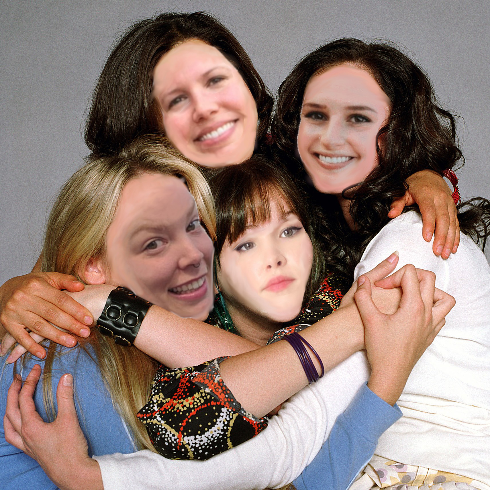

# Nutshell
### A place to hold all your stuff

The goal of this project was to work as a team to build an app that holds various information pertaining to a specific user.
___
## Instructions for using the project locally
1. Navigate to the directory in which you want Welcome to Nashville to reside
1. Using your terminal, run ```git@github.com:nss-day-cohort-32/nutshell-the-functioning-sisterhood.git```
1. Install ```npm install -g json-server```
1. Navigate to the src/lib and  run ```npm install```
1. In a new terminal tab, run the json server ```json-server --watch db.json```
1. Don't forget to run your local server as well

### **You may now run the app!**



### The Sisterhood of the Traveling Semicolons is comprised of the following members
- Ellie Ash
- Emily Loggins
- Shelley Arnold
- Heather Cleland